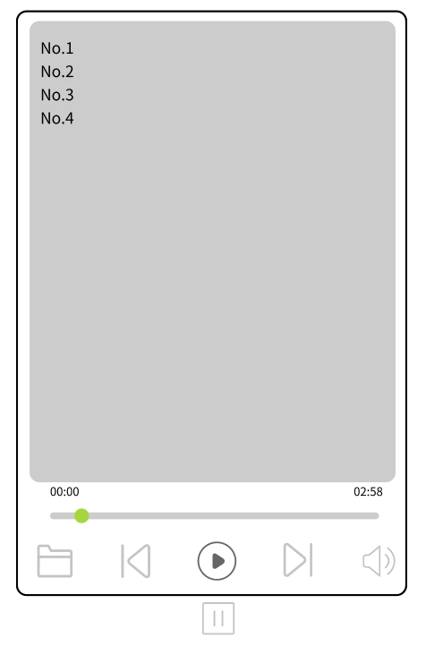

## MusicPlayer

### 设计图

https://js.design/f/jsVYgy?p=Eqq1Nq6j23

### 实现图

### 不足之处

1. 有些音乐无法播放，需要参考4中，安装额外的解码器才可以播放
2. 进度条拖动有问题，拖动操作必须在1s内完成
3. 音量大小调节按键功能未实现
4. 分辨率适配问题有待考虑

### 参考

1. 水平进度条样式

   

   [QT控件QSlider样式编辑实例 - 知乎 (zhihu.com)](https://zhuanlan.zhihu.com/p/264468759#:~:text=Slider.setStyleSheet("QSlider%3A%3Agroove%3Ahorizontal { border%3A 0px solid %23bbb%3B } QSlider%3A%3Asub-page%3Ahorizontal,%23eee%3B border%3A 1px solid %23aaa%3B border-radius%3A 4px%3B }")%3B)

2. QListWidget样式

   

   [使用QSS简单修改QListWidget样式 - 知乎 (zhihu.com)](https://zhuanlan.zhihu.com/p/404771405)

3. 音乐文件下载

   [8个免费下载无损歌曲的网站，值得收藏 - 知乎 (zhihu.com)](https://zhuanlan.zhihu.com/p/577560145)

4. 报错：DirectShowPlayerService::doRender: Unresolved error code 0x80040266 ()

   [(24条消息) Qt播放视频报错 DirectShowPlayerService::doRender: Unresolved error code 0x80040266_@小戚的博客-CSDN博客](https://blog.csdn.net/qq_41071706/article/details/89855986)

5. 字符串格式化

   [(25条消息) QT基础 - QString使用arg() 格式化_qstring 格式化_Adunn的博客-CSDN博客](https://blog.csdn.net/limeigui/article/details/125047866)

6. qt打包

   [(25条消息) Qt项目发布打包教程(win10)_qt程序打包_天空的飞鸟的博客-CSDN博客](https://blog.csdn.net/weixin_42523686/article/details/116136455)

